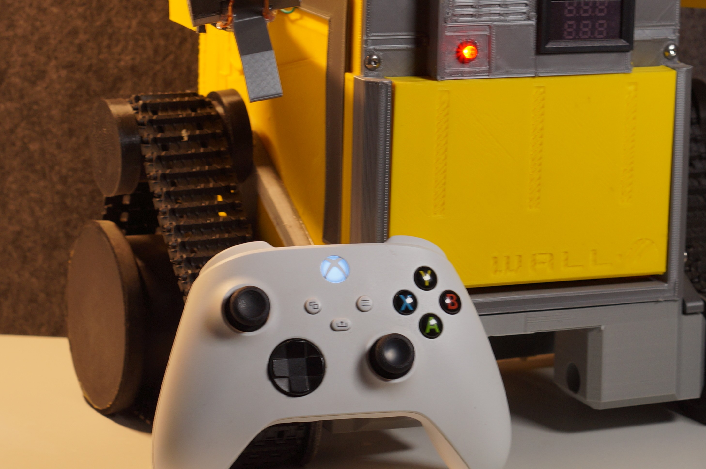
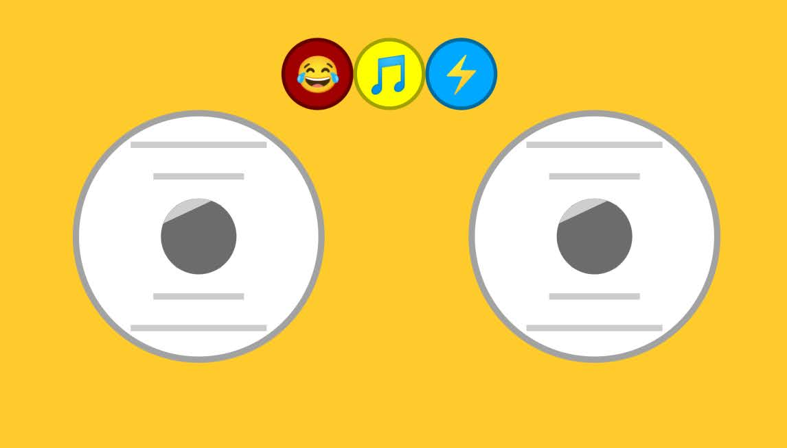
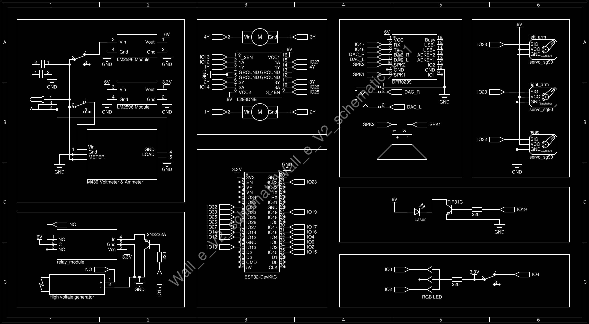

# Wall-E Robotic Project

This is my personal project, Wall-E, a robot I designed and built from scratch.

It includes electronics, 3D printed parts, servo motors, sound, a laser, and a taser system (for fun). I made everything myself.

## 📦 Project Contents

- `code/`: Arduino code (multiple versions)
- `schematics/`: Schematics, diagrams, and professional circuits
- `3d_models/`: 3D printed designs
- `photos/`: High quality photos of the project
- `sounds/`: Audio effects used in the robot
- `libraries/`: Arduino libraries used in the code
- `components/`: Full Component List

## 🕹️ Control System

This robot can be controlled using:
- Xbox Controller (Bluetooth)

- Remote XY App (previous versions)

## 🔩 Full Component List

You can find a complete, organized list of all electronic, mechanical, and auxiliary components used in this project in the spreadsheet below:

📄 [Wall-E-V2_components_list.xlsx](components/Wall-E-V2_components_list.xlsx)

This table includes:
- Quantity and part numbers  
- Technical specifications  
- Purpose in project  
- Reason for selection  
- Reference images  

Also i made a schematic with all the conections

## 🛠️ Tools and Platforms Used

Here’s a list of the main tools and platforms I used throughout the WALL·E project:

- **Fusion 360** – Designed 3D parts of the robot and exported STL files for 3D printing.
- **Fritzing** – Simulated circuits and verified wiring before building the physical prototype.
- **EasyEDA** – Created professional circuit schematics and organized the wiring logic.
- **Arduino IDE** – Developed and uploaded firmware to the ESP32 microcontroller.
- **GitHub** – Used for version control, documentation, and collaboration.

## 📸 Preview

## 📂 Version History

- v1.0: Basic control and movement
- v2.8: Bluetooth control with Remote XY
- v3.4: Xbox Controller and sound system added

## 🧠 Author

Created by: **Nicolás (io1)**  

