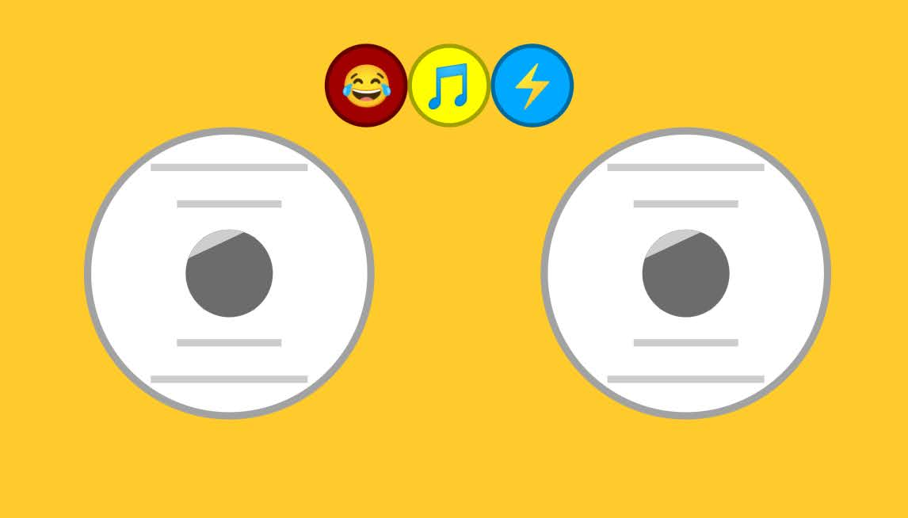

# Wall-E Robotic Project

This is my personal project, Wall-E, a robot I designed and built from scratch.

It includes electronics, 3D printed parts, servo motors, sound, a laser, and a taser system (for fun). I made everything myself.

## 📦 Project Contents

- `code/`: Arduino code (multiple versions)
- `schematics/`: Schematics, diagrams, and professional circuits
- `3d_models/`: 3D printed designs
- `photos/`: High quality photos of the project
- `sounds/`: Audio effects used in the robot
- `libraries/`: Arduino libraries used in the code

## 🕹️ Control System

This robot can be controlled using:
- Xbox Controller (Bluetooth)
- Remote XY App (previous versions)

## ⚙️ Electronics

Main controller: ESP32  
Motors: L-shaped Yellow Gearmotors  
Arms: MG996R Servos  
Head: SG90 Servo  
Power: 18650 Battery Pack (7.4V)  
And much more...

## 📸 Preview

## 📂 Version History

- v1.0: Basic control and movement
- v2.8: Bluetooth control with Remote XY
- v3.4: Xbox Controller and sound system added

## 🧠 Author

Created by: **Nicolás (io1)**  

